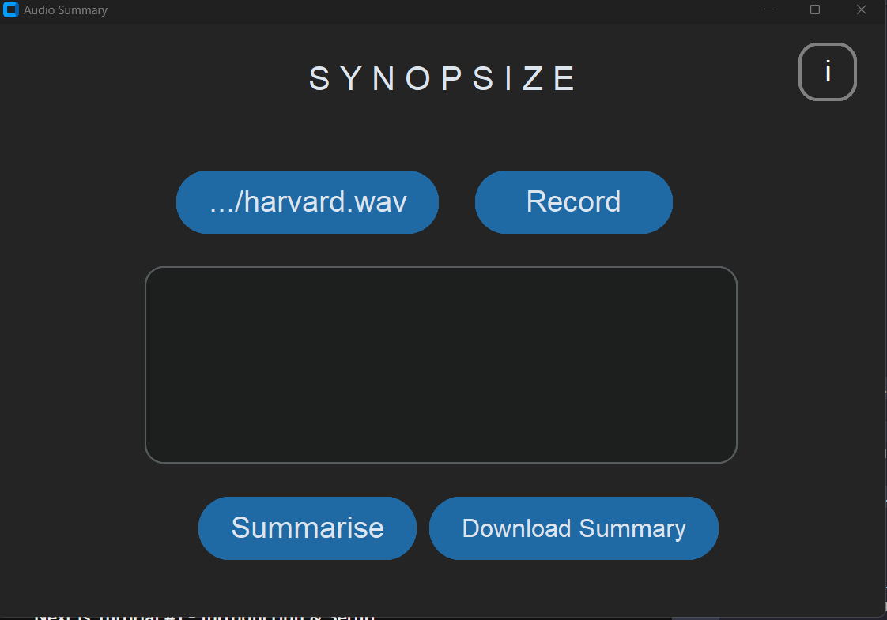

# Synopsize

## Introduction

Synopsize is a desktop application built using Python's custom tkinter library. It is a meeting summarizer that summarizes the audio or text of the meeting to provide a brief summary. This application can also summarize any text file. The summary text is formatted well and includes accurate summaries to make it easy to understand.

## Features

- Support for .mp3 and .wav files
- Download summary for retention
- Live Recording
- Formatted file with date, time, and title

## Screenshots

## Installation

To install and use the application, you need to have Python and pip installed, custom tkinter, and ffmpeg. Follow the below steps for installation:

1. Install Python and pip on your computer.
2. Install the custom tkinter library.
3. Install ffmpeg.
4. Download the Synopsize repository from GitHub.
5. Open the terminal in the downloaded directory.
6. Run the following command to install the required packages:
             
             pip install -r requirements.txt
  
After installing the required packages, you can run the application using the following command:

This will open the Synopsize application on your desktop.

## Usage

To use the application, follow these steps:

1. Open the Synopsize application.
2. Click on the "Browse" button to select the audio file or text file that you want to summarize.
3. Select the "Live Recording" option to record a live meeting.
4. Click on the "Summarize" button to get the summary of the meeting or file.
5. You can download the summary by clicking on the "Download" button.

## Authors

This application is developed by Sarah, Altaf, Abhigyaan, and Amisha.

## Acknowledgments

We would like to thank our professor and classmates for their valuable feedback and support during the development of this project.
